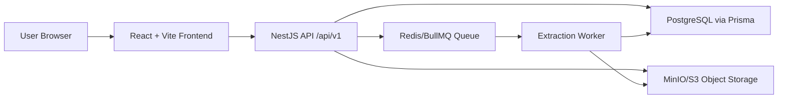

# LifeOS Product Requirements Document

Tanggal dokumen: 2026-04-29

## Ringkasan Produk

LifeOS adalah aplikasi personal operating system berbasis web untuk mengelola agenda, rutinitas, catatan, produktivitas PARA, arsip, dokumen, dan bantuan AI dalam satu workspace. Aplikasi saat ini menggunakan React + Vite di frontend dan NestJS + Prisma + PostgreSQL di backend, dengan MinIO/S3-compatible storage untuk file upload dan Redis/BullMQ untuk antrian ekstraksi dokumen.

Produk berada pada fase transisi dari aplikasi frontend-heavy berbasis localStorage menuju aplikasi multi-user dengan backend persisten. Refactor frontend sudah memecah kode ke modul fitur utama, tetapi beberapa file fitur besar masih memuat banyak sub-komponen.

## Tujuan Produk

1. Menyediakan workspace terpadu untuk perencanaan harian, rutinitas, todo, jadwal, catatan, produktivitas, arsip, dan sumber daya digital.
2. Mendukung banyak user dengan isolasi data berdasarkan user dan role.
3. Menyediakan fondasi penyimpanan dokumen dalam jumlah besar melalui object storage.
4. Menyiapkan pipeline ekstraksi informasi dari dokumen untuk fitur pencarian, ringkasan, dan AI di fase berikutnya.
5. Mempertahankan user flow yang sudah ada saat migrasi dari localStorage ke API.

## Persona Utama

- Super Admin: mengelola user, konfigurasi aplikasi, seluruh data lintas user, dan pengaturan branding.
- Admin: dapat membaca/mengelola data lintas user pada beberapa endpoint backend, tetapi UI manajemen user saat ini masih berorientasi super admin.
- Member: pengguna utama untuk planner, notes, productivity, resource, dan archive workflow miliknya sendiri.
- Viewer: pengguna read-only. Backend mencegah write pada record generic untuk role viewer.

## Ruang Lingkup Saat Ini

### Frontend

Frontend berada di `frontend/src` dan dibangun dengan React 19, Vite, Tailwind CSS, lucide-react, dan html5-qrcode.

Modul utama:

- `App.jsx`: login portal, sesi auth, bootstrap user/settings dari API.
- `features/dashboard/Dashboard.jsx`: shell aplikasi, sidebar, overview, dark mode, global state, routing internal, lazy-loaded feature modules.
- `features/planner/Planner.jsx`: daily agenda, schedule manager, master routine, todo, agenda type, referensi productivity.
- `features/notes/NotesManager.jsx`: free notes, AI notes, audio recording/transcription, file extraction via Gemini, free lists.
- `features/productivity/ProductivityManager.jsx`: PARA areas, projects, project tasks/actions, resources, archives, timeline/calendar views.
- `features/fileControl/FileControlManager.jsx`: archive control, classification, JRA, physical references, disposition, borrowing, QR/scan, movement, arrangement.
- `features/resources/ResourceComponents.jsx`: input attachment/resource, AI metadata modal, resource list.
- `features/settings/SettingsManager.jsx`: user management UI, profile, app branding, Gemini API key, global search, chatbot.
- `components/shared.jsx`: modal konfirmasi, alert, pagination, markdown renderer.
- `components/forms/SearchableDropdown.jsx`: dropdown search reusable.
- `lib/apiClient.js`: API wrapper, auth session localStorage, mapping storage key ke record type.
- `lib/lifeosUtils.js`: utilities tanggal, ID, routine/schedule validators, state hooks, upload helper, Gemini helper.

### Backend

Backend berada di `backend/src` dan dibangun dengan NestJS 11, Prisma 6, PostgreSQL, JWT, Argon2, Helmet, Redis/BullMQ, dan AWS S3 SDK untuk object storage.

Modul utama:

- `AuthModule`: login, refresh token, logout, current user.
- `UsersModule`: CRUD user dengan role guard.
- `SettingsModule`: global app settings.
- `RecordsModule`: generic JSON record storage untuk data LifeOS.
- `UploadsModule`: upload/download/list/delete asset.
- `StorageModule`: S3-compatible object storage adapter.
- `ExtractionModule`: BullMQ queue dan worker ekstraksi dokumen.
- `HealthModule`: health check.
- `PrismaModule`: koneksi Prisma.

## Arsitektur Saat Ini



## Model Data Utama

### User

Menyimpan akun aplikasi, role, profil, dan API key Gemini. Password disimpan sebagai `passwordHash` menggunakan Argon2. Public response menghapus `passwordHash`.

Role:

- `super_admin`
- `admin`
- `member`
- `viewer`

### RefreshToken

Menyimpan hash refresh token, expiry, revoked timestamp. Refresh token diganti saat dipakai.

### AppSettings

Konfigurasi global branding:

- `name`
- `navSub`
- `loginSub`
- `motto`
- `welcomeTitle`
- `welcomeSub`
- `footerText`

### LifeosRecord

Generic record store berbasis JSON:

- `userId`
- `type`
- `title`
- `date`
- `payload`
- `deletedAt`

Record type yang digunakan frontend:

- `agenda_type`
- `routine`
- `schedule`
- `todo`
- `completion`
- `free_note`
- `ai_note`
- `list`
- `para_project`
- `para_area`
- `para_task`
- `para_activity`
- `para_resource`
- `para_archive`
- `archive_classification`
- `archive_jra`
- `archive_physical_reference`
- `archive_borrowing`
- `archive_disposition`
- `archive_move_log`

### Asset

Metadata dokumen/file di object storage:

- `bucket`
- `objectKey`
- `originalName`
- `mimeType`
- `size`
- `checksum`
- `status`
- `source`
- `context`

Status asset:

- `uploaded`
- `queued`
- `extracting`
- `ready`
- `failed`

### AssetExtraction

Hasil ekstraksi dari asset:

- `status`
- `extractedText`
- `summary`
- `metadata`
- `error`
- `startedAt`
- `completedAt`

Status extraction:

- `pending`
- `extracting`
- `completed`
- `unsupported`
- `failed`

## Kontrak API Saat Ini

Base URL default frontend: `http://localhost:4000/api/v1`

### Health

- `GET /health`
  - Response: `{ status, service, timestamp }`

### Auth

- `POST /auth/login`
  - Body: `{ email, password }`
  - Response: `{ user, accessToken, refreshToken }`
- `POST /auth/refresh`
  - Body: `{ refreshToken }`
  - Response: session baru
- `POST /auth/logout`
  - Body: `{ refreshToken }`
  - Response: `{ success: true }`
- `GET /auth/me`
  - Header: Bearer access token
  - Response: current auth payload/user context

### Users

Guarded by JWT and roles.

- `GET /users`
- `GET /users/:id`
- `POST /users`
- `PATCH /users/:id`
- `DELETE /users/:id`

Current backend policy:

- `super_admin` dan `admin` dapat list/read.
- hanya `super_admin` dapat create/update/delete.

### Settings

- `GET /settings/app`
- `PATCH /settings/app`

Current backend policy:

- read perlu JWT.
- update perlu `super_admin` atau `admin`.

### Records

- `GET /records/:type`
  - Query optional: `userId`, `from`, `to`
- `POST /records/:type`
- `POST /records/:type/bulk`
  - Body: `{ items: [...] }`
- `PATCH /records/:id`
- `DELETE /records/:id`

Current backend policy:

- viewer tidak dapat write.
- member hanya akses data miliknya.
- admin/super_admin dapat membaca lintas user bila query userId dipakai.
- bulk replace melakukan soft-delete record aktif target user/type lalu membuat record baru dari payload.

### Uploads/Assets

- `POST /uploads`
  - multipart field: `file`
  - max file size saat ini: 100 MB
  - Response: `{ id, originalName, mimeType, size, checksum, status, extractionStatus, createdAt, url }`
- `GET /uploads`
  - Query optional: `take`, dibatasi 1-100.
  - Response: daftar asset metadata.
- `GET /uploads/:id`
  - Stream file dari object storage.
- `GET /uploads/:id/metadata`
  - Response: metadata asset + extraction.
- `DELETE /uploads/:id`
  - Hapus object storage dan metadata asset.

## State Management Frontend

State saat ini berbasis React state dan custom hooks:

- `useStickyState`: menyimpan UI/session/config lokal ke localStorage.
- `useUserAwareState`: data domain disimpan dalam React state, dihydrate dari API `/records/:type`, dicache ke localStorage namespace `lifeos-api-cache:<userId>:<storageKey>`, lalu disinkronkan ke backend dengan debounce 700ms via bulk replace.

Mapping frontend storage key ke backend record type berada di `frontend/src/lib/apiClient.js`.

Penting:

- Data domain lama dari localStorage key legacy tidak lagi menjadi source of truth.
- Cache localStorage tetap digunakan sebagai cache cepat untuk API.
- `Dashboard.jsx` adalah pemilik state domain utama dan meneruskan data/setter ke feature modules.

## Fitur Produk Saat Ini

### Login dan Session

- User login melalui email/password.
- Token disimpan di localStorage key `lifeos-auth`.
- `lifeos-user` masih disimpan untuk kompatibilitas UI.
- Logout memanggil backend logout dan membersihkan session lokal.

### Dashboard

- Sidebar navigasi: overview, planner, notes, productivity, file control, settings.
- Dark mode persist di localStorage.
- Overview menampilkan agenda, rutinitas aktif, todo, notifikasi, dan shortcut ke modul.
- Global search dan chatbot diload dari SettingsManager secara lazy.
- Feature modules diload dengan `React.lazy` dan `Suspense`.

### Planner

- Daily agenda.
- Schedule manager.
- Master routine dengan frequency daily/weekly/monthly/interval.
- Freeze/unfreeze routine.
- Todo/task quick input.
- Agenda type management.
- Resource attachment dan referensi catatan.

### Notes

- Free notes.
- AI notes.
- Free lists.
- Attachment audio/file untuk AI notes.
- Integrasi Gemini untuk transcription, extraction, summary, dan chatbot context.

### Productivity

- PARA style management: areas, projects, project tasks/actions, resources, archive.
- Project detail, area detail, activity, timeline/calendar, resource management.
- Resource upload diarahkan ke backend upload.
- AI summary resource masih berbasis Gemini frontend.

### File Control

- Archive/document control workflow.
- Classification reference.
- JRA reference.
- Physical reference hierarchy.
- Archive processing modal.
- Archive detail.
- Borrowing/return/cancel.
- Disposition/destruction/static transfer.
- Bulk move and movement logs.
- QR generation and QR scanning using html5-qrcode.
- Arrangement explorer dengan folder-like navigation.

### Settings

- User management UI.
- Profile update.
- API key Gemini per user.
- App branding/content settings.
- Logo upload masih diproses di frontend/local state.
- Global search.
- Floating chatbot.

## Penyimpanan Dokumen dan Extraction

Upload flow saat ini:

1. Frontend memanggil `uploadFileToBackend(file)`.
2. `api.uploadFile` mengirim multipart ke `/uploads`.
3. Backend menghitung SHA-256 checksum.
4. Backend menulis object ke MinIO/S3 dengan key `userId/YYYY/MM/timestamp-uuid.ext`.
5. Backend membuat record `Asset` dan `AssetExtraction`.
6. Backend enqueue job `asset-extraction`.
7. Worker membaca object dan mengekstrak teks bila MIME type text/JSON/XML/YAML.
8. Worker menyimpan `extractedText`, `summary`, dan metadata extraction.

Dokumen biner seperti PDF/DOCX sudah tersimpan sebagai asset, tetapi extractor konten belum diimplementasikan.

## Non-Functional Requirements

### Performance

- Frontend menggunakan route/module code splitting untuk feature besar.
- API cache lokal digunakan agar UI cepat hydrate.
- Backend menggunakan object storage untuk menghindari beban folder lokal ketika dokumen banyak.
- Extraction berjalan asynchronous via queue.

### Security

- Password menggunakan Argon2.
- JWT access token dan refresh token.
- Refresh token disimpan sebagai hash dan direvoke saat refresh/logout.
- Backend memakai Helmet.
- CORS dikontrol dengan `CORS_ORIGIN`.
- Role guard digunakan untuk users/settings.
- Records dan uploads melakukan access check user/role.

### Scalability

- Generic `LifeosRecord` mempercepat migrasi dari localStorage dan memberi fleksibilitas payload.
- Asset storage berbasis S3-compatible sehingga bisa diganti dari MinIO lokal ke S3/R2/B2/Wasabi.
- Redis/BullMQ memungkinkan worker extraction dipisah dari API process di fase lanjut.

### Reliability

- Prisma migrations tersedia.
- Upload metadata dan object storage belum dibungkus kompensasi transaction lintas storage/database; bila salah satu gagal, perlu cleanup strategy di fase lanjut.
- Bulk replace memakai soft-delete record lama dan createMany record baru.

## Risiko dan Technical Debt

1. `FileControlManager.jsx` masih sangat besar, sekitar 11 ribu baris, dan perlu refactor lanjutan per subdomain.
2. `ProductivityManager.jsx` masih besar, sekitar 5 ribu baris.
3. Generic JSON record store cepat untuk migrasi, tetapi sulit untuk query/constraint domain yang kompleks.
4. Frontend masih melakukan beberapa operasi AI langsung ke Gemini dari browser menggunakan API key user.
5. Refresh token lookup melakukan scan token aktif dan verify satu per satu; perlu token id/jti strategy untuk skala besar.
6. Upload menggunakan memory storage dengan limit 100 MB; untuk file besar dan jumlah banyak perlu streaming upload/presigned URL.
7. Extraction baru mendukung text-like MIME types.
8. API belum memiliki automated test suite.
9. Frontend lint meloloskan beberapa unused/hook warnings pada file besar karena file-level disable sebelumnya.
10. App settings masih global, belum tenant/workspace-aware.

## Prioritas Pengembangan Berikutnya

### P0 - Fondasi Stabil

- Tambahkan automated tests backend untuk auth, records, uploads, dan permissions.
- Tambahkan endpoint refresh otomatis di frontend API client saat access token expired.
- Rapikan warning/encoding string yang tampak seperti `©` dan karakter mojibake di UI.
- Tambahkan error boundary React per feature lazy module.

### P1 - Dokumen Banyak

- Ubah upload besar ke direct-to-object-storage flow dengan presigned URL.
- Tambahkan extractor PDF, DOCX, XLSX, dan image OCR.
- Tambahkan status polling/list UI untuk asset extraction di Productivity Resources.
- Tambahkan full-text search atas extracted text.
- Tambahkan deduplication policy berbasis checksum per user.

### P1 - Multi-User dan Governance

- Buat tenant/workspace model bila aplikasi akan dipakai organisasi.
- Perjelas role matrix di frontend dan backend.
- Tambahkan audit log untuk upload/delete/disposition/borrow/restore.
- Tambahkan user invitation/change password flow.

### P2 - Domain Data

- Migrasikan domain paling penting dari JSON payload ke tabel terstruktur bertahap.
- Prioritaskan `para_project`, `para_task`, `para_resource`, dan archive entities bila butuh reporting/query kompleks.
- Tambahkan migration/import tool dari legacy localStorage/cache ke backend bila diperlukan.

## Acceptance Criteria Saat Ini

- User dapat login menggunakan akun seed.
- Dashboard dapat memuat data dari API dan tetap memakai cache lokal saat API lambat/offline.
- Perubahan data domain tersinkron ke `/records/:type/bulk`.
- Upload file dari frontend menghasilkan asset di backend.
- File text-like diekstrak otomatis.
- Admin/super admin dapat mengelola user sesuai role backend.
- Viewer tidak dapat menulis record melalui backend.
- Build dan lint frontend/backend berjalan bersih.

## Environment Development

Backend:

```bash
cd backend
docker compose up -d
npm run prisma:generate
npm run prisma:migrate
npm exec prisma db seed
npm run dev
```

Frontend:

```bash
cd frontend
npm run dev
```

Default URLs:

- Frontend: `http://localhost:5173`
- Backend API: `http://localhost:4000/api/v1`
- Health: `http://localhost:4000/api/v1/health`
- PostgreSQL: `localhost:55432`
- Redis: `localhost:6380`
- MinIO API: `http://localhost:9002`
- MinIO Console: `http://localhost:9003`

Default users:

- `admin@lifeos.com` / `123`
- `viewer@lifeos.com` / `123`
